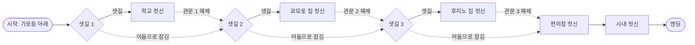

# LookBack_aScene

> 영화 「룩백」의 한 장면을 걷는 3~5분짜리 도트 웹게임

**▶ 플레이: https://kimbyeonghoon51.github.io/LookBack_aScene/**

눈이 펑펑 내리는 밤, 후지노와 쿄모토가 손을 잡고 편의점으로 향합니다.
둘이 1년 동안 함께 그린 첫 만화가 잡지에 실렸는지 확인하기 위해서입니다.
가로등 불빛만 따라 걷다 보면, 둘이 함께 지나온 장소들이 하나씩 나타납니다.

PC(키보드)와 모바일(터치)에서 모두 플레이할 수 있습니다.

---

## 1. 기획 의도

- 영화 「룩백」에서 인상 깊었던 **눈길 장면**을 직접 걸어 보는 경험을 만들고 싶었다.
- 그래서 게임 이름도 *룩백의 한 장면*이라는 뜻의 **LookBack_aScene**으로 지었다.
- 길을 걷는 동안 둘의 추억이 담긴 장소(학교, 쿄모토 집, 후지노 집)를 차례로 지나며, 영화의 이야기를 짧게 되돌아본다(look back).
- 목표는 **3~5분 안에 끝나는 간단하고 감성적인 게임**이다.
- 취미로 만든 비상업 팬 게임이다.

## 2. 게임 개요

| 항목 | 내용 |
|---|---|
| 장르 | 탑다운 걷기 · 어드벤처 |
| 플랫폼 | 웹 브라우저 (GitHub Pages), PC · 모바일 |
| 플레이 시간 | 약 3~5분 (샛길 3곳을 모두 들렀을 때) |
| 목표 | 가로등을 따라 세 샛길의 추억을 모두 지나 편의점, 그리고 시내까지 가기 |
| 분위기 | 밤, 펑펑 내리는 눈, 어두운 시골 눈길, 따뜻한 가로등 불빛 |

## 3. 조작

| 동작 | PC | 모바일 |
|---|---|---|
| 이동 | 방향키 | 왼쪽 아래 조이스틱 |
| 귀 막기 | Space | 오른쪽 아래 「귀 막기」 버튼 |
| 컷신 닫기 | ESC (Space·Enter: 글자 바로 보기) | 화면 탭 |
| 소리 켜기/끄기 | M | 오른쪽 위 버튼 |

## 4. 핵심 시스템: 추위

| 상황 | 추위 게이지 |
|---|---|
| 걷는 중 | 초당 **+3** |
| 제자리에 서 있음 | 초당 **−1** |
| 귀 막기 (Space) | 2초 동안 제자리에서 귀를 막고, 끝나면 **0으로 초기화** · 쿨타임 **5초** |
| **80 이상** | 화면에 「너무 추워요! Space를 눌러 귀를 막으세요」 경고 |
| **100 도달** | **5초 동안 얼어붙음**(이동 불가), 이후 0으로 초기화 |

- 귀를 막는 동안에는 두 사람이 손을 놓고 제자리에서 귀를 감싼다. 이때 바람 소리도 먹먹하게 들린다.
- 쭉 걷기만 하면 약 33초 만에 얼어붙는다. 그래서 적당한 타이밍에 멈춰 귀를 막는 것이 이 게임의 리듬이다.

## 5. 레벨 디자인



- **메인 도로**를 쭉 직진하면 끝에 **시내**가 있다. 길 중간에 **샛길 3개**가 차례로 나온다.
- 각 샛길 입구를 지난 메인 도로는 **짙은 어둠으로 잠겨 있다**. 앞의 가로등은 꺼져 있고 지나갈 수도 없다.
- 샛길 끝 장소에 도착해 컷신을 보면 **어둠이 걷히고**, 관문에서 가까운 가로등부터 하나씩 켜진다(종소리와 함께). 그래서 세 샛길은 **반드시 순서대로 들러야** 한다.
  1. 샛길 1 → **학교**: 후지노가 쿄모토의 존재를 알게 되는 곳
  2. 샛길 2 → **쿄모토 집**: 둘이 처음 만난 곳
  3. 샛길 3 → **후지노 집**: 둘이 본격적으로 만화를 그리게 된 곳
- 세 번째 관문이 풀리면 메인 도로 위의 **편의점**에서 컷신이 나온다. 계속 직진해 **시내**에 도착하면 마지막 컷신을 보고 게임이 끝난다.
- 갈림길에는 **힌트가 없다**. 대신 눈 위에 **발자국**이 남기 때문에 내가 어디서 왔는지 알 수 있다.
- 도로 밖의 깊은 눈밭에는 들어갈 수 없다. 길 주변의 시골 풍경은 어둡지만 은은하게 보인다.

## 6. 장소와 컷신

| 장소 | 컷신 내용 |
|---|---|
| 시작화면 | 1년 동안 함께 그린 만화가 잡지에 실렸는지 확인하러 편의점으로 떠나는 여정 |
| 학교 | 후지노는 학년 신문에 4컷 만화를 그린다. 후지노가 쿄모토의 그림을 처음 보게 되는 장면 |
| 쿄모토 집 | 후지노와 쿄모토의 첫 만남. 쿄모토가 후지노의 열렬한 팬임을 고백하는 장면 |
| 후지노 집 | 후지노와 쿄모토는 친구가 된다. 둘이 후지노 집에서 같이 만화를 그리는 장면 |
| 편의점 | 둘이 눈밭을 뚫고 편의점에 도착한다. 1년 동안 준비한 만화가 잡지에 실렸는지 확인하는 장면 |
| 시내 | 둘은 시내로 놀러 나간다. 놀고 난 뒤 지하철에서 나누는 대화 장면 (엔딩) |

- 대사보다 **컷신 중심**으로 이야기를 전한다. 화면에 나올 실제 문구는 아직 다듬는 중이다.
- 보도자료로 공개된 컷이 많지 않아서, 한 장면에 이미지 한 장을 쓴다.
- 연출: 장소에 닿으면 **화면이 환하게 밝아진다** → 이미지가 **모자이크에서 점점 선명한 도트**로 떠오른다 → 이미지 위로 **눈이 내리고**, 글자가 한 자씩 나온다.

## 7. 캐릭터

| | 후지노 | 쿄모토 |
|---|---|---|
| 머리 | 단발 + **노란 비니** | 긴 머리 |
| 목도리 | **초록** | **빨강** |
| 옷 | **파란 코트**, 청바지 | **핑크 패딩**, 검은 바지 |
| 움직임 | 플레이어가 조종 | 후지노와 **손을 잡고 뒤따라옴**, 항상 **후지노의 등을 바라봄** |

## 8. 아트와 연출

- **그림체: 도트(픽셀아트).** 도트와 수채화 두 가지 데모를 만들어 비교한 뒤 도트로 정했다. 비교용 데모는 `LookBack_aScene_style_demo.html`에 있다.
- **어둠과 빛:** 플레이어 주변과 가로등 아래만 밝다. 빛은 도트 느낌이 나도록 계단처럼 퍼진다. 가로등은 길을 따라 빽빽하게 서 있어서 불빛이 항상 시야에 들어온다. 몇 개는 깜빡인다.
- **시골 배경:** 눈 덮인 논(벼 그루터기, 논둑), 삼나무 숲, 농가와 흰 창고, 비닐하우스, 얼어붙은 개울, 전봇대와 전선이 있다.
- **발자국:** 두 사람의 발자국이 나란히 남고, 약 3분에 걸쳐 새 눈에 덮이며 흐려진다.
- **눈:** 바람 세기에 따라 눈발이 휘날리고, 불빛 근처의 눈송이가 더 밝게 빛난다. 걸을 때마다 입김도 나온다.
- **건물:** 학교(시계탑, 현관 차양, 고드름), 쿄모토 집(홈통, 실외기, 큰 나무), 후지노 집(불 켜진 창, 우편함, 눈 덮인 자전거), 편의점(자판기, 진열대), 시내(역, 네온, 옥상 물탱크)

## 9. 사운드

- **발자국 소리:** 직접 준비한 눈 밟는 효과음(8초)에서 걸음 8개 구간만 잘라 쓴다. 한 걸음마다 무작위로 하나를 고르고, 높낮이를 조금씩 바꿔서 같은 소리가 반복되지 않게 했다. 쿄모토의 발소리는 더 작다.
- **배경음:** 영화 「룩백」 메인 테마. 유튜브 공식 업로드를 화면 구석의 작은 플레이어로 재생한다. 음원 파일을 내려받지 않는다.
- **환경음:** 바람 소리(귀를 막으면 먹먹해짐), 관문이 풀릴 때 울리는 작은 종소리

## 10. 기술 구성

- HTML 파일 하나에 Canvas 2D와 순수 JavaScript로 만들었다. 빌드 과정이나 외부 엔진이 없다.
- 저해상도 캔버스에 그린 뒤 CSS로 확대해서 도트 느낌을 낸다.
- 시골 배경은 처음 한 번만 큰 캔버스에 그려 두고, 매 프레임 보이는 부분만 잘라 쓴다.
- 효과음은 Web Audio API, 배경음은 YouTube IFrame Player API로 재생한다.
- 글꼴은 [Galmuri](https://github.com/quiple/galmuri)(한글 도트 글꼴)를 쓴다.

```
LookBack_aScene.html            게임 본편
index.html                      GitHub Pages 진입점 (본편으로 이동)
snow_steps.js                   발자국 효과음 (SnowWalking.mp3를 base64로 담은 파일)
SnowWalking.mp3                 발자국 효과음 원본
시작화면.png, 학교.jpg, …        시작화면 · 컷신 이미지
LookBack_aScene_style_demo.html 그림체 비교 데모 (도트 / 수채화)
```

> 배경음(유튜브)은 웹 주소로 열었을 때만 재생됩니다. 파일을 더블클릭해서 열면 유튜브 정책 때문에 플레이어가 막힙니다.

## 11. 개발 기록 (주요 결정)

1. **기본 구상:** 탑다운 시점, 방향키 이동, 어두운 밤 설원, 가로등을 따라가는 길 찾기, 발자국과 서걱 소리. 스페이스로 귀를 막아 추위를 피한다.
2. **그림체:** 도트와 수채화 데모를 비교한 뒤 **도트**로 정했다.
3. **추위 밸런스:** 처음에는 이동 중 +3/초, 귀 막기 −30이었다. 이후 서 있으면 −1/초, 귀 막기는 2초 정지 후 0으로 초기화, 쿨타임 5초로 바꿨다.
4. **레벨 변경:** 처음에는 오답 갈림길(쿄모토 집·후지노 집·학교·논·호수·신사)이 있는 미로였다. 이후 **메인 도로 + 추억의 샛길 3개 + 편의점 + 시내(엔딩)** 구조로 바꿨다. 호수·논·신사는 뺐다.
5. **샛길 필수화:** 장소 컷신을 봐야 앞길의 어둠이 풀리는 **관문** 방식을 넣었다.
6. **배경:** 갈 수 없는 곳을 새까맣게 두지 않고, 어둡지만 은은하게 보이는 **시골 농촌 풍경**으로 채웠다.
7. **연출 추가:** 장소 도착 시 밝아지는 효과, 컷신 위에 내리는 눈, 추위 80 경고 문구, 건물 도트 디테일, 모바일 터치 조작

## 12. 저작권 고지

- 이 게임은 **비상업 팬 창작물**입니다. 판매하거나 수익을 내지 않습니다.
- 원작 「룩백」 © 藤本タツキ / 集英社, 영화 © 2024 Look Back Film Partners
- 시작화면과 컷신 이미지는 영화의 공식 공개 이미지이며, 모든 권리는 원저작자에게 있습니다.
- 배경음은 유튜브의 공식 업로드를 임베드 플레이어로 재생하며, 음원 파일을 포함하지 않습니다.
- 권리자의 요청이 있으면 즉시 내리겠습니다.
